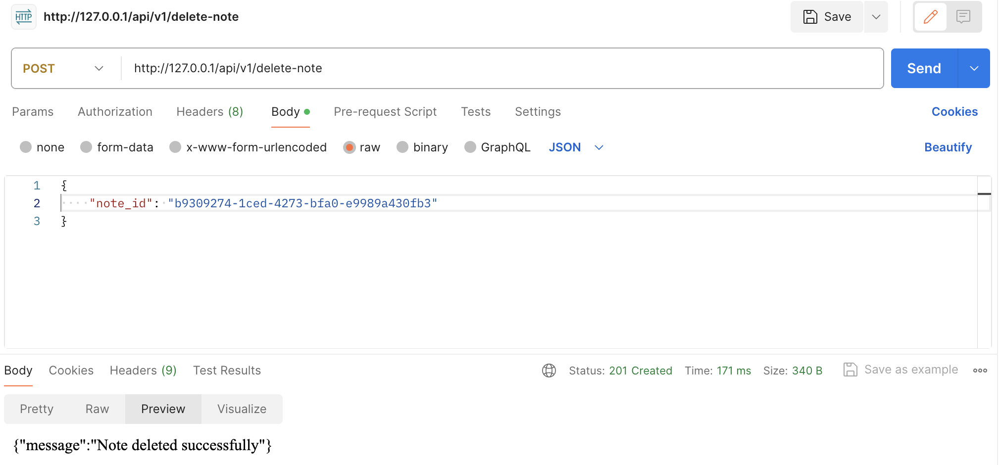

### To run the app:

1. Clone the repository.
2. Once inside the repo, run:
    ```bash
    docker run --rm \
        -u "$(id -u):$(id -g)" \
        -v $(pwd):/opt \
        -w /opt \
        laravelsail/php83-composer:latest \
        composer install --ignore-platform-reqs
    ```
3. Run `vendor/bin/sail up`.

### To test the app:

- Run `vendor/bin/sail test` or `vendor/bin/sail test --coverage`.

The coverage report will be located in `tests/Coverage` folder.

Additionally, manual testing of API points can be performed via Postman, and this is an example request:


### Api description:

API contract can be found [here](Contracts/api.yaml).

### Design choice:

In developing this project, I opted for the CQRS (Command Query Responsibility Segregation) and Repository pattern instead of adhering strictly to Laravel's conventional MVC (Model-View-Controller) architecture. While Laravel's MVC offers a streamlined and rapid development process, the decision to embrace CQRS and the Repository pattern was motivated by the desire for a more modular, scalable, and maintainable codebase. This approach segregates read and write operations, allowing for independent scaling and optimization of each aspect of the system. The Repository pattern provides a centralized and abstracted data access layer, promoting better code organization and testability. Although this choice might introduce a slightly steeper learning curve, it offers greater flexibility, improved separation of concerns, and facilitates the evolution of the application's architecture as requirements evolve over time.

### TODOs:

While adopting the CQRS and Repository pattern may have introduced some challenges, such as a longer development timeline, it has enabled a robust and test-driven development (TDD) methodology. Prioritizing TDD in the development process has ensured that the features that have been implemented are thoroughly tested and maintain a high level of code quality. Although not all features may be fully realized at this stage, the emphasis on TDD guarantees a solid foundation for future feature additions and enhancements. This disciplined approach to development not only enhances the reliability of the existing features but also establishes a resilient framework for accommodating future functionalities with confidence.

Within the codebase, there are currently a couple of TODOs placed to indicate areas where further development is required. The next steps would involve addressing these TODOs, implementing additional features, and incorporating a robust layer of authentication for enhanced security. A static code analysis tools is also needed to ensure code quality and adherence to best practices.
Additionally, the integration of a comprehensive CI/CD pipeline would further enhance the development process and ensure a seamless and automated deployment workflow.

